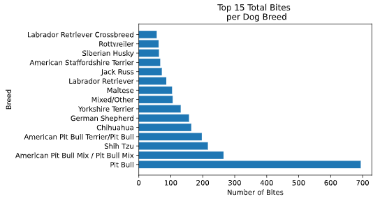
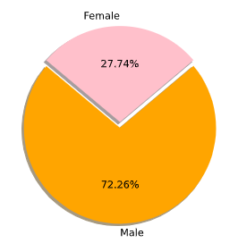
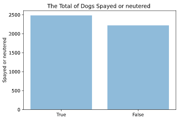
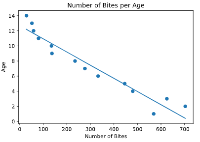

# Who's a good dog?

### Introduction
It is a popular belief that dog breeds such as pitbulls, rottweilers and dobermans are dangerous pets and are seen to attack more people out of any other breed. The purpose of this analysis was to find which breed of dog actually committed the most bite out of all the breeds. 

### Data and Model
Since the analysis was to find which breed commited the most bites. A bar graph would suffice for the comparison between breeds. Also, analyzed the ratio of genders to see if one gender is more prone to aggression and also compared dogs who were spayed/neutered or not to see if that had any influence to attack. Lastly, an implementation of a scatter plot was used to check if age also effected the total amount of bites. 

### Result
The outcome of the first bar graph below shows that Pitbull committed the most bites out of any breed. Even more than the 2 breeds combined following behind pitbulls.  

The second graph revealed that the gender that bit the most were male dogs. 

Third graph showed that there was no significant difference between dogs that were either spay/neutered or not. 

Lastly, the regression was to show if there was a relationship with the age of the dogs and amount of bites a dog will commit. The graph below shows that as dogs age they are less likely to bite anyone. The result of the r value is -0.96 which indicates a very strong relationship.

### Conclusion
As to popular beliefs, it does seem that pitbulls are more likely to bite more than any other breed. Specifically, very young male pitbulls. As to why this is the case, it is unknown at the moment. The dataset did not account for other variables such as, if the dogs were either trained or untrained, stray or owned and the setting where the bitings occur. Who were the dogs biting? People or other animals? These unaccounted variables could be factors in why certain breeds bite more than others. Which will need further analysis and research.